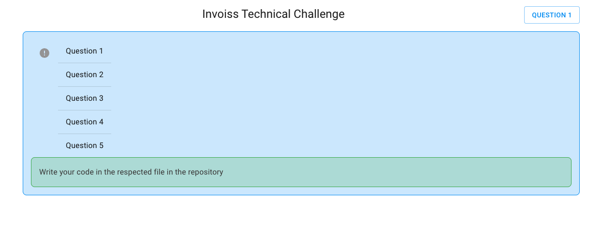

[<p align="center"></p>](https://invoiss.com)

<div align="center">
<h1>Welcome to Invoiss React JS Technical Interview</h1> 
</div>

### This challenge has an interactive UI and requires you to run the project.
- All the questions in the challenge require you to have a good understanding of React and all of its familiar frameworks, JavasScript, TypesScript and API handling. 
- If you are familiar with those, then this challenge should be very straight forward. 
   
# Requirements: 
- All of your components, functions, objects and code must be typed with TypeScript. 
- You must use React Hooks, no class components.
- When using TypeScript, `any` and `@ts-ignore` should be avoided unless necessary and justified with comments. 
- Has no Lint Errors (Utilize Eslint).
- Your code is clean, formatted, imports are sorted. 
- And finally has a beautiful UI.

# Installation

- First, download this project as a .Zip or Fork it (if you fork it, make sure to set the project to private NOT PUBLIC), open up the project and run the development server:

```bash
yarn
yarn dev
```

- Open [http://localhost:3000](http://localhost:3000) with your browser to see the result.

  - Write your code/response in each file under the respected question.

**Once you see the home page below, you are on your way!**

<p align="center"></p>


### There are 5 parts/questions to this challenge, all of which need to be completed to progress to the next step of the interview. 

## Question 1

#### Design a form with Formik and Material UI which contains the following items:

```bash 
- Name
- Date (datetime)
- Active (boolean switch)
- Age (select from 1 to 70)
- Perform error handling on the form
```
<hr>

## Question 2

#### Create an api function in NextJS that takes an object with this type:

```bash 
- {id: string, name: string}[]
- {id: name}
```
- Perform error handling so that any object without that shape will throw an error.
- Call the function from a button press.
- You can use any library for this
  
<hr>

## Question 3

#### Convert the providers in `src/pages/_app.tsx` to use the `providerComposer` provided in `src/providerComposer.tsx`.

<hr>

## Question 4

#### In `src/pages/dataBase` create a trigger/function which will calculate the age on insert or modify given the birthday.


<hr>

## Question 5

#### In this final question your task is to create a [Combo Box](https://www.w3.org/TR/wai-aria-practices/#combobox) but also known as an Auto Complete Input. 
- #### Your goal is to create a custom Combo Box that replicates [Auto Complete](https://mui.com/components/autocomplete/#main-content) component from MUI as best as possible.
#### We understand that creating such component would take a long time but to keep it short we are going to focus on implementing only a few functionalities within it. 

- A Combo Box is a combination of TextField and a dropdown. 
- Use the [TextField](https://mui.com/components/text-fields/) component from MUI and allow the user to search through a list of 200 plus options within the dropdown.
- It needs to have a prop for `renderInput` and a prop for `options`
- The options can be an array containing of 200 objects. 
- Example of the options array : 
```JavaScript 
const top200Films = [ 
	{ label: 'The Shawshank Redemption', year: 1994 },
	{ label: 'The Godfather', year: 1972 },
  	{ label: 'The Godfather: Part II', year: 1974 }, 
	...200 other options
]
``` 
- If the query that the user typed is not in the list of options, inform the user in the dropdown that the entry does not exist. 
- You may refer to the [Material UI Auto Complete](https://mui.com/components/autocomplete/#main-content) or [W3.org Combo Box Examples](https://www.w3.org/TR/wai-aria-practices/examples/combobox/aria1.1pattern/listbox-combo.html) for reference of finished examples. 
- Finally, make sure it has a beautiful UI. 
  
- ## As a bonus (but not required): 
- Add a prop for disabled options. Which will still show the option in the input if you search it but you can not select it. 
- Add Controlled States : The Component has two states that can be controlled. 
  - the "value" state with the `value`/`onChange` props combination. This state represents the value selected by the user, for instance when pressing Enter.
  - the "input value" state with the `inputValue`/`onInputChange` props combination. This state represents the value displayed in the textbox.
  - These two states are isolated, they should be controlled independently.


# Submission 

- ### Please keep in mind that, we love to encourage our developers to seek google and the online dev community for answers and help. But these tasks above are what we expect from a developer to do on their own when hired as a developer at Invoiss.

**DO NOT** host your project on a public repository.
**DO NOT** create a pull request to this project.
## You have 2 options to submit your code : 
  - Create a _.zip_ but without the _node_modules_ and upload it to a google drive and share your link to the drive at company@invoiss.com
  - If you host it on a private repository on GitHub then invite [@pouyarezvani](https://github.com/pouyarezvani) to access it. 
